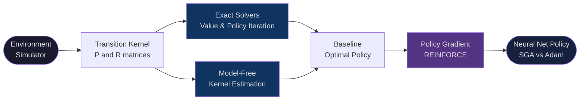

<div align="center">

# Predator-Prey Reinforcement Learning

### From exact tabular solutions to deep policy gradient — a full RL pipeline on an N×N grid

<br/>

[](https://www.python.org/)
[](https://pytorch.org/)
[](https://numpy.org/)
[](LICENSE)

<br/>

> **A complete reinforcement learning pipeline applied to a Predator-Prey game. Starts with exact tabular policy evaluation, progresses through sparse solvers and model-free kernel estimation, and culminates in a neural network policy trained with REINFORCE.**

</div>

---

## The Problem

A predator chases prey on an N×N grid. The predator acts optimally; the prey moves randomly. The goal is to learn a policy that catches the prey as efficiently as possible.

| | |
|---|---|
| **State** | (predator position, prey position) → N⁴ states |
| **Actions** | Stay, Up, Down, Left, Right → 5 actions |
| **Reward** | +1 on catch, 0 otherwise |
| **Prey** | Moves uniformly at random over valid neighbors |
| **Discount γ** | 0.99 |

After a catch, the prey re-spawns at a random empty cell. Predator moves are deterministic and boundary-clamped.

---

## Pipeline



---

## Stage 1 — Environment

`predator_prey/env/`

The core simulator takes a state and action, samples the stochastic prey transition, and returns the next state and reward. Everything else in the pipeline is built on top of this.

```python
from predator_prey.env.simulator import simulator

next_pred, next_prey, reward = simulator(N=4, pred_pos=(2,2), prey_pos=(4,4), action=1)
```

| Module | Role |
|--------|------|
| `simulator.py` | One-step stochastic MDP transition |
| `state_space.py` | State/action encoding — maps (pred, prey) → flat index |
| `reward_function.py` | Builds full expected reward matrix R \[|S| × |A|\] |
| `transition_engine.py` | Constructs the transition kernel from simulator rollouts |
| `induced_reward.py` | Computes policy-induced reward vector r_π |

---

## Stage 2 — Transition Kernel

`predator_prey/core/`

The transition kernel P maps (state, action) pairs to next-state distributions. We support two representations depending on grid size:

<details>
<summary><b>Dense kernel</b> — exact, fast for small N</summary>

<br/>

Shape: `(|S|·|A|, |S|)`. Stored as a dense `ndarray`. Analytically computed from the simulator dynamics.

Memory scales as 5·N⁸·8 bytes:

| N | \|S\| | Kernel RAM |
|---|-------|-----------|
| 5 | 625 | ~16 MB |
| 6 | 1,296 | ~133 MB |
| 7 | 2,401 | ~661 MB |

```python
from predator_prey.core.kernel import kernel
P = kernel(N=5)  # shape: (|S|*|A|, |S|)
```

</details>

<details>
<summary><b>Sparse kernel</b> — scales to larger grids</summary>

<br/>

Same semantics, stored as a `scipy.sparse` matrix. Reduces memory by ~10-50× for typical grids.

```python
from predator_prey.core.kernel_sparse import kernel_sparse
P = kernel_sparse(N=7)
```

</details>

<details>
<summary><b>Model-free estimation</b> — no analytical model</summary>

<br/>

Approximates P from simulator samples using frequency counting. No access to the true dynamics beyond the `simulator()` call.

```python
from predator_prey.core.estimate_kernel import estimate_kernel
P_est = estimate_kernel(N=4, n_samples=50000)
```

Estimation error decreases as O(1/√n_samples). Useful for testing model-free algorithms where the true kernel is unavailable.

</details>

---

## Stage 3 — Exact Solvers

`predator_prey/algorithms/`

With the kernel in hand, solve for the optimal policy exactly.

<details>
<summary><b>Value Iteration</b></summary>

<br/>

Applies Bellman optimality updates until convergence:

```
V_{k+1}(s) = max_a [ R(s,a) + γ · Σ_{s'} P(s'|s,a) · V_k(s') ]
```

```python
from predator_prey.algorithms.value_iteration import value_iteration
V_star, pi_star = value_iteration(P, R, gamma=0.99)
```

</details>

<details>
<summary><b>Policy Iteration</b></summary>

<br/>

Alternates between full policy evaluation (solve linear system) and greedy policy improvement. Converges in fewer iterations than VI at higher per-iteration cost.

```python
from predator_prey.algorithms.policy_iteration import policy_iteration
pi_star = policy_iteration(P, R, gamma=0.99)
```

</details>

---

## Stage 4 — Policy Evaluation

`predator_prey/core/`

Given any policy π, evaluate it exactly:

```python
from predator_prey.core.state_value_eval import state_value_eval
from predator_prey.core.q_value_eval import q_value_eval

V = state_value_eval(Pi, P, R)   # shape: (|S|, 1)
Q = q_value_eval(Pi, P, R)       # shape: (|S|, |A|)
```

Bellman evaluation iterates until `‖V_{k+1} - V_k‖∞ < 1e-8`.

---

## Stage 5 — Deep Policy Gradient (REINFORCE)

`predator_prey/algorithms/` · `predator_prey/core/gradient_estimate.py`

Instead of a tabular policy, learn a **neural network** policy end-to-end from interaction:

```
Input  : 32-dim one-hot — 16 dims predator position | 16 dims prey position
Hidden : Linear(32 → 128) + ReLU
Hidden : Linear(128 → 128) + ReLU
Output : Linear(128 → 5) → Categorical distribution
```

The gradient estimator uses:
- **Discounted returns** — `G_t = r_t + γ·r_{t+1} + ...`
- **Baseline subtraction** — `advantage = G_t − mean(G)` (reduces variance)
- **Advantage normalisation** — `advantage /= std(advantage)`
- **Gradient clipping** — `clip_grad_norm_(params, 1.0)`

Two optimizers are compared:

| | Simple SGA | Adam |
|---|---|---|
| Update rule | `θ ← θ + α·∇J` | Adaptive moment estimates |
| Learning rate | 0.005 | 0.003 |
| Convergence | Slower, noisier | Faster, more stable |

<details>
<summary><b>Full hyperparameter table</b></summary>

| Hyperparameter | Value |
|----------------|-------|
| Grid size N | 4 |
| Discount γ | 0.99 |
| Episodes per gradient estimate | 20 |
| Max steps per episode | 50 |
| Training iterations | 2,000 |
| Gradient clip norm | 1.0 |
| EMA smoothing (plots) | 0.95 |
| Random seed | 42 |

</details>

---

## Getting Started

```bash
pip install -r requirements.txt
```

```bash
# Run the full tabular pipeline (dense)
python scripts/generate_plots_q1.py
python scripts/run_q1.py

# Run with sparse kernel + exact solvers
python scripts/generate_plots_q2.py
python scripts/run_q2.py

# Run model-free kernel estimation
python scripts/generate_plots_q3.py
python scripts/run_q3.py

# Train neural net policy — SGA vs Adam (~10-20 min on CPU)
python scripts/generate_plots_q4.py   # → learning_curves.png
python scripts/run_q4.py              # → report PDF
```

---

## Package Layout

```
predator_prey/
├── env/
│   ├── simulator.py
│   ├── state_space.py
│   ├── reward_function.py
│   ├── transition_engine.py
│   └── induced_reward.py
├── core/
│   ├── kernel.py
│   ├── kernel_sparse.py
│   ├── induced_kernel.py
│   ├── estimate_kernel.py
│   ├── q_value_eval.py
│   ├── state_value_eval.py
│   └── gradient_estimate.py
└── algorithms/
    ├── value_iteration.py
    ├── policy_iteration.py
    ├── sample_policy.py
    ├── policy_network.py
    ├── simple_sga.py
    └── run_adam.py

scripts/
├── run_q{1..4}.py
└── generate_plots_q{1..4}.py
```

---

<div align="center">

**Tabular MDPs · Sparse Kernels · Deep Policy Gradient**

</div>
