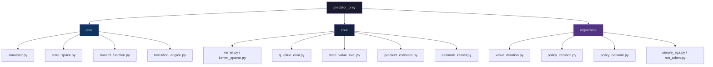

<div align="center">

# Predator-Prey Reinforcement Learning

### A deep-dive into tabular MDPs, kernel methods, and policy gradient algorithms

<br/>

[](https://www.python.org/)
[](https://pytorch.org/)
[](https://numpy.org/)
[](LICENSE)

<br/>

> **A full implementation suite for solving a Predator-Prey MDP on an N×N grid — from exact tabular methods (value/policy iteration) to deep policy gradient agents (REINFORCE with SGA and Adam), progressing through kernel estimation and model-free RL.**

</div>

---

## 📌 Table of Contents

<details open>
<summary><b>Click to expand</b></summary>

- [🎯 Problem Statement](#-problem-statement)
- [📦 Project Structure](#-project-structure)
- [🧩 Modules](#-modules)
  - [Q1 — Dense Tabular Evaluation](#q1--dense-tabular-evaluation)
  - [Q2 — Policy & Value Iteration (Sparse)](#q2--policy--value-iteration-sparse)
  - [Q3 — Kernel Estimation from Samples](#q3--kernel-estimation-from-samples)
  - [Q4 — Deep Policy Gradient (REINFORCE)](#q4--deep-policy-gradient-reinforce)
- [🚀 Getting Started](#-getting-started)
- [🏗️ Package Layout](#️-package-layout)

</details>

---

## 🎯 Problem Statement

The **Predator-Prey MDP** is a classic reinforcement learning benchmark:

- 🗺️ **Grid**: N × N board (default N = 4)
- 🦊 **Predator**: Moves deterministically; 5 actions — Stay, Up, Down, Left, Right
- 🐭 **Prey**: Moves stochastically — uniform random over valid adjacent cells
- 🏆 **Reward**: `+1` when predator catches prey (same cell); `0` otherwise
- 🔄 **Post-catch**: Prey re-spawns uniformly in any non-predator cell

| Quantity | Formula | Size (N=4) |
|----------|---------|------------|
| State space \|S\| | N⁴ | 256 |
| Action space \|A\| | 5 | 5 |
| Discount factor γ | 0.99 | — |

---

## 📦 Project Structure

```
predator-prey-rl/
│
├── predator_prey/              # 📚 Core Python package
│   ├── env/                    # Environment dynamics
│   │   ├── simulator.py        # One-step stochastic MDP simulator
│   │   ├── state_space.py      # State encoding/decoding utilities
│   │   ├── reward_function.py  # Expected reward matrix R [|S|×|A|]
│   │   ├── transition_engine.py# Builds full transition kernel
│   │   └── induced_reward.py   # Policy-induced reward vector r_π
│   ├── core/                   # Evaluation & estimation tools
│   │   ├── kernel.py           # Dense transition kernel P [|S|·|A|×|S|]
│   │   ├── kernel_sparse.py    # Sparse kernel variant
│   │   ├── induced_kernel.py   # Policy-induced kernel P_π
│   │   ├── estimate_kernel.py  # Model-free kernel estimation (Q3)
│   │   ├── q_value_eval.py     # Q-function evaluator Q^π
│   │   ├── state_value_eval.py # State-value evaluator V^π
│   │   └── gradient_estimate.py# REINFORCE gradient estimator (Q4)
│   └── algorithms/             # RL algorithm implementations
│       ├── value_iteration.py  # Value iteration solver
│       ├── policy_iteration.py # Policy iteration solver
│       ├── sample_policy.py    # Greedy-mix sample policy
│       ├── policy_network.py   # PyTorch neural network policy
│       ├── simple_sga.py       # Simple Stochastic Gradient Ascent
│       └── run_adam.py         # Adam optimizer runner
│
├── scripts/                    # 🏃 Experiment runner scripts
│   ├── run_q1.py               # Dense tabular evaluation + report
│   ├── run_q2.py               # Sparse iteration + policy iteration
│   ├── run_q3.py               # Kernel estimation experiment
│   ├── run_q4.py               # Policy gradient training + report
│   ├── generate_plots_q1.py    # Q1 plots: V^π vs N, runtimes
│   ├── generate_plots_q2.py    # Q2 plots: convergence, policy comparison
│   ├── generate_plots_q3.py    # Q3 plots: estimation error
│   └── generate_plots_q4.py    # Q4 plots: SGA vs Adam learning curves
│
├── requirements.txt
└── README.md
```

---

## 🧩 Modules

### Q1 — Dense Tabular Evaluation

Implements **exact policy evaluation** using dense NumPy matrices across grid sizes N ∈ {3, 4, 5, 6, 7}.

| Script | Description |
|--------|-------------|
| `env/simulator.py` | Stochastic MDP step function |
| `env/state_space.py` | State/action encoding |
| `env/reward_function.py` | Reward matrix R \[|S| × |A|\] |
| `core/kernel.py` | Dense transition kernel P |
| `core/q_value_eval.py` | Q-function Q^π from V^π |
| `core/state_value_eval.py` | Iterative Bellman evaluation |
| `algorithms/sample_policy.py` | ε-greedy mix policy |

**Memory scaling of the dense kernel:**

| N | \|S\| | Kernel RAM |
|---|-------|-----------|
| 5 | 625 | ~16 MB |
| 6 | 1,296 | ~133 MB |
| 7 | 2,401 | ~661 MB |

---

### Q2 — Policy & Value Iteration (Sparse)

Extends Q1 with **sparse matrix representations** and solves the MDP exactly using:
- **Value Iteration** — Bellman optimality updates until convergence
- **Policy Iteration** — Alternating policy evaluation + greedy improvement

New modules: `core/kernel_sparse.py`, `algorithms/policy_iteration.py`, `algorithms/value_iteration.py`, `env/transition_engine.py`

---

### Q3 — Kernel Estimation from Samples

Implements **model-free kernel estimation**: approximates the transition kernel P from simulator samples using frequency counting — no model access beyond simulation.

New module: `core/estimate_kernel.py`

---

### Q4 — Deep Policy Gradient (REINFORCE)

Trains a **neural network policy** using the REINFORCE algorithm with two optimizers:

```
Input  : 32-dim one-hot  (16-dim predator block | 16-dim prey block)
Hidden : Linear(32→128) + ReLU → Linear(128→128) + ReLU
Output : Linear(128→5) → Categorical distribution over actions
```

**Gradient estimator** features:
- Discounted returns: `G_t = r_t + γ·r_{t+1} + ...`
- Baseline subtraction: `advantage = G_t − mean(G)`
- Advantage normalisation: `advantage /= std(advantage)`
- Gradient clipping: `clip_grad_norm_(params, 1.0)`

**Training hyperparameters:**

| Hyperparameter | Value |
|----------------|-------|
| Grid size (N) | 4 |
| Discount (γ) | 0.99 |
| Episodes per gradient | 20 |
| Max steps per episode | 50 |
| Training iterations | 2000 |
| LR — Simple SGA | 0.005 |
| LR — Adam | 0.003 |
| Gradient clip norm | 1.0 |
| Random seed | 42 |

---

## 🚀 Getting Started

### Prerequisites

```bash
pip install -r requirements.txt
```

### Run Experiments

```bash
# Q1: Dense tabular evaluation
python scripts/generate_plots_q1.py    # Generate plots
python scripts/run_q1.py               # Full report

# Q2: Sparse value/policy iteration
python scripts/generate_plots_q2.py
python scripts/run_q2.py

# Q3: Kernel estimation
python scripts/generate_plots_q3.py
python scripts/run_q3.py

# Q4: Policy gradient (SGA vs Adam) — ~10-20 min on CPU
python scripts/generate_plots_q4.py   # Saves learning_curves.png
python scripts/run_q4.py              # Full report PDF
```

### Use the Package

```python
from predator_prey.env.simulator import simulator
from predator_prey.core.kernel import kernel
from predator_prey.env.reward_function import reward_function
from predator_prey.core.state_value_eval import state_value_eval
from predator_prey.algorithms.sample_policy import sample_policy

N  = 4
P  = kernel(N)              # Transition kernel
R  = reward_function(N)     # Reward matrix
Pi = sample_policy(N)       # Sample policy
V  = state_value_eval(Pi, P, R)   # V^π
```

---

## 🏗️ Package Layout



---

<div align="center">


*Tabular MDPs × Sparse Kernels × Deep Policy Gradient*

</div>
